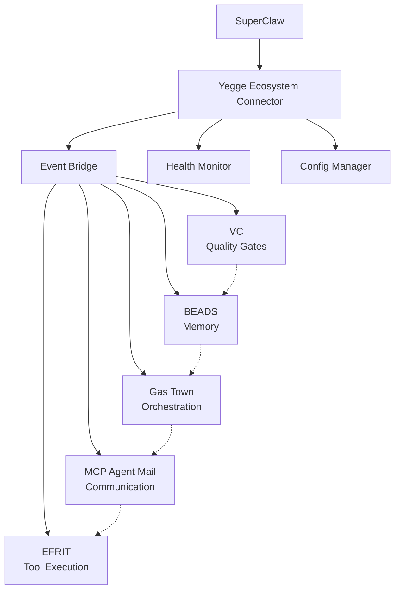

# Yegge Ecosystem Connector Hub

🧠 **Unified integration point for Steve Yegge's complete multi-agent development ecosystem**

This integration provides SuperClaw with a single, unified interface to all of Steve Yegge's battle-tested multi-agent development tools, bringing together persistent memory, orchestration, communication, quality gates, and safe tool execution into a coordinated system.

## 🎯 Vision

Transform SuperClaw from single-agent workflows to **coordinated agent colonies** that can build software at superhuman scale, leveraging the production-proven patterns from Yegge's ecosystem.

## 🧩 Connected Components

### 1. 🧠 BEADS - Memory & Task Management
- **Purpose**: Git-backed graph issue tracker for persistent agent memory
- **Stars**: ⭐ 16,882
- **Key Features**:
  - Dependency-aware task tracking
  - Cross-session memory persistence  
  - Hash-based IDs prevent merge conflicts
  - Semantic memory compaction
  - Epic → Task → Sub-task hierarchy

### 2. 🏭 Gas Town - Multi-Agent Orchestration  
- **Purpose**: Multi-agent workspace manager with persistent work tracking
- **Stars**: ⭐ 9,944
- **Key Features**:
  - The Mayor: AI coordinator pattern
  - Rigs: Git worktree-based project containers
  - Polecats: Worker agents with persistent identity
  - Convoys: Work tracking units bundling beads
  - MEOW Pattern: Mayor-Enhanced Orchestration Workflow

### 3. 📮 MCP Agent Mail - Inter-Agent Communication
- **Purpose**: "Gmail for coding agents" - asynchronous coordination layer
- **Stars**: ⭐ 34
- **Key Features**:
  - Agent directory/LDAP for discovery
  - File reservation system prevents conflicts
  - Searchable message history
  - Cross-project coordination
  - Cryptographic signing and encryption

### 4. 🏭 VC - Quality Gates & Agent Colony
- **Purpose**: Production agent colony with proven quality gates
- **Stars**: ⭐ 300
- **Key Features**:
  - **90.9% quality gate success rate** (production proven)
  - 254+ issues completed through dogfooding
  - AI Supervised Issue Loop
  - Zero Framework Cognition (AI makes all decisions)
  - Self-hosting: system builds and improves itself

### 5. 🔧 EFRIT - Tool Execution Patterns
- **Purpose**: Emacs-native agent runtime with safety-first tool execution
- **Stars**: ⭐ 393
- **Key Features**:
  - 35+ tools with safety controls
  - Real-time session management
  - Checkpoint and rollback support
  - Natural language to action translation
  - Zero client-side intelligence

## 🚀 Quick Start

### Installation & Setup

```bash
# Initialize the Yegge ecosystem
superclaw yegge start

# Check overall status
superclaw yegge status

# Monitor events in real-time
superclaw yegge events --watch

# Run demonstration workflow
superclaw yegge workflow demo
```

### Programmatic Usage

```typescript
import { createYeggeEcosystemConnector } from '@/integrations/yegge';

// Create connector with auto-start
const connector = createYeggeEcosystemConnector({ autoStart: true });

// Subscribe to quality gate events
connector.subscribeToEvents(
  { source: ['vc'], type: ['quality-gate-passed', 'quality-gate-failed'] },
  (event) => {
    console.log(`Quality gate ${event.type}:`, event.data.qualityGate);
  }
);

// Execute coordinated multi-agent workflow
const result = await connector.executeCoordinatedWorkflow({
  id: 'build-pipeline',
  name: 'Complete Build Pipeline',
  description: 'Full CI/CD pipeline with quality gates',
  tasks: [
    { id: 'analysis', name: 'Code Analysis', type: 'code', tools: ['linter', 'ast-parser'] },
    { id: 'build', name: 'Build', type: 'code', tools: ['compiler', 'bundler'] },
    { id: 'test', name: 'Test Suite', type: 'test', tools: ['test-runner', 'coverage'] },
    { id: 'deploy', name: 'Deploy', type: 'deploy', tools: ['docker', 'kubernetes'] }
  ],
  dependencies: [
    { taskId: 'build', dependsOn: ['analysis'] },
    { taskId: 'test', dependsOn: ['build'] },
    { taskId: 'deploy', dependsOn: ['test'] }
  ],
  startTime: Date.now()
});

console.log(`Workflow completed: ${result.status}`);
console.log(`Agents used: ${result.metrics.totalAgents}`);
console.log(`Quality gates passed: ${result.metrics.qualityGatesPassed}`);
```

## 📋 CLI Commands

### Core Commands

```bash
# System Management
superclaw yegge status          # Show ecosystem status and health
superclaw yegge start           # Start all enabled components  
superclaw yegge stop            # Stop all components
superclaw yegge config          # Show current configuration

# Monitoring & Events
superclaw yegge health          # Detailed health monitoring
superclaw yegge health --watch  # Continuous health monitoring
superclaw yegge events          # Monitor all ecosystem events
superclaw yegge events --filter vc  # Filter events by component

# Workflows & Components  
superclaw yegge workflow demo   # Run demonstration workflow
superclaw yegge workflow list   # List available workflows
superclaw yegge components      # Show component details
superclaw yegge components beads status  # Component-specific operations
```

### Advanced Usage

```bash
# Configuration Management
superclaw yegge config --full   # Show complete configuration
export YEGGE_BEADS_REPO=/path/to/memory  # Override BEADS repository
export YEGGE_MCP_PORT=3001      # Override MCP Agent Mail port

# Component Control
superclaw yegge components beads start    # Start only BEADS
superclaw yegge components vc config      # Show VC configuration
superclaw yegge components gastown logs   # View Gas Town logs

# Workflow Examples
superclaw yegge workflow build             # Complete build pipeline
superclaw yegge workflow refactor          # Multi-agent refactoring
superclaw yegge workflow review            # Code review coordination
```

## 🏗️ Architecture

### Event Flow Architecture



### Integration Patterns

1. **Mayor Pattern** (Gas Town → SuperClaw Swarms)
   - Centralized AI coordinator
   - Convoy-based work tracking
   - Git-backed persistence

2. **Persistent Memory** (BEADS → SuperClaw Context)
   - Replace ephemeral task queues
   - Cross-session memory preservation
   - Dependency-aware distribution

3. **Quality Gates** (VC → SuperClaw Validation)
   - Multi-stage validation pipelines
   - AI-driven quality assessment
   - Self-healing workflows

4. **Safe Tool Execution** (EFRIT → SuperClaw Tools)
   - Safety-first execution patterns
   - Real-time progress tracking
   - Session state management

5. **Agent Communication** (MCP → SuperClaw Coordination)
   - Inter-agent messaging protocols
   - File conflict resolution
   - Cross-project coordination

## 📊 Production Metrics

Based on Yegge's production deployments:

- **VC Success Rate**: 90.9% quality gate pass rate
- **Issues Completed**: 254+ through dogfooding
- **Mission Success**: 24 successful missions
- **Target Scale**: 20-30 agent workflows
- **Tool Safety**: 35+ tools with safety controls
- **Memory Efficiency**: Semantic compaction reduces context usage

## ⚙️ Configuration

### Environment Variables

```bash
# Core Components
YEGGE_BEADS_REPO=/path/to/beads/memory
YEGGE_GASTOWN_WORKSPACE=/path/to/gastown/workspace
YEGGE_MCP_PORT=3001

# Integration Settings
YEGGE_EVENT_BRIDGE_ENABLED=true
YEGGE_HEALTH_MONITORING_ENABLED=true
YEGGE_CROSS_PROJECT_ENABLED=true

# Quality Settings
YEGGE_VC_SUCCESS_RATE_TARGET=90.9
YEGGE_GASTOWN_MAX_AGENTS=20
YEGGE_HEALTH_CHECK_INTERVAL=30
```

### Component Configuration

```typescript
const config: YeggeConfig = {
  beads: {
    enabled: true,
    repositoryPath: './yegge-memory',
    memoryDecay: {
      enabled: true,
      compactionThresholdMB: 100,
      semanticSummaryModel: 'claude-3-5-sonnet-20241022'
    },
    taskHierarchy: {
      enableEpics: true,
      enableSubtasks: true,
      autoReadyDetection: true
    }
  },
  gastown: {
    enabled: true,
    mayor: {
      model: 'claude-3-5-sonnet-20241022',
      maxAgents: 20,
      orchestrationStrategy: 'centralized'
    }
  },
  vc: {
    enabled: true,
    production: {
      targetSuccessRate: 90.9,
      enableSelfHosting: true
    },
    qualityGates: {
      enabled: true,
      gates: [
        { name: 'lint', command: 'npm run lint', required: true },
        { name: 'test', command: 'npm test', required: true },
        { name: 'build', command: 'npm run build', required: true }
      ]
    }
  }
  // ... more config
};
```

## 🔍 Monitoring & Health

### Health Dashboard

```bash
superclaw yegge status
```

Shows:
- ✅ Overall ecosystem health
- 📊 Component-specific metrics
- ⚠️ Active alerts and warnings
- 📈 Performance statistics
- 🔄 Real-time status updates

### Event Monitoring

```bash
superclaw yegge events
```

Real-time event stream from all components:
- 🧠 BEADS: Task events, memory compaction
- 🏭 Gas Town: Agent spawning, convoy updates
- 📮 MCP Agent Mail: Message flow, file reservations  
- 🏭 VC: Quality gate results, issue completion
- 🔧 EFRIT: Tool execution, safety checks

### Health Alerts

The system monitors:
- Response times (threshold: 5 seconds)
- Error rates (threshold: 5%)
- Memory usage (threshold: 512MB per component)
- Quality gate success rates
- Agent availability
- Communication latency

## 🛣️ Roadmap

### Phase 1: Foundation ✅
- [x] Unified configuration system
- [x] Event bridge architecture
- [x] Health monitoring framework
- [x] CLI command interface
- [x] Basic workflow orchestration

### Phase 2: Integration 🚧
- [ ] Actual BEADS API integration
- [ ] Gas Town Mayor pattern implementation
- [ ] MCP Agent Mail server connection
- [ ] VC quality gate integration
- [ ] EFRIT tool execution patterns

### Phase 3: Production 🔮
- [ ] Multi-project coordination
- [ ] Advanced workflow templates
- [ ] Performance optimization
- [ ] Enterprise governance features
- [ ] Cloud deployment patterns

## 🤝 Contributing

This integration is designed to work with Yegge's existing ecosystem. Rather than forking or reimplementing:

1. **Extend existing tools** where possible
2. **Contribute to Yegge's repositories** 
3. **Build complementary capabilities**
4. **Share learnings and patterns**

### Development Setup

```bash
# Clone SuperClaw with Yegge integration
git clone https://github.com/your-org/superclaw
cd superclaw

# Install dependencies
npm install

# Initialize Yegge components (mock mode for development)
superclaw yegge start

# Run tests
npm test src/integrations/yegge/

# Development mode with hot reload
npm run dev
```

### Testing

```bash
# Unit tests
npm test src/integrations/yegge/

# Integration tests  
npm run test:integration yegge

# CLI tests
npm run test:cli yegge

# Mock component tests
superclaw yegge workflow demo
```

## 📚 References

- **Yegge Ecosystem Analysis**: `/docs/intel/yegge-ecosystem-map.md`
- **BEADS Repository**: https://github.com/steveyegge/beads
- **Gas Town Repository**: https://github.com/steveyegge/gastown  
- **MCP Agent Mail**: https://github.com/steveyegge/mcp_agent_mail
- **VC Repository**: https://github.com/steveyegge/vc
- **EFRIT Repository**: https://github.com/steveyegge/efrit

## 🏆 Success Metrics

Adoption of Yegge patterns should deliver:

- **90%+ Quality Gate Success** (proven in VC production)
- **Cross-Session Memory** (no context loss between sessions)
- **Multi-Agent Coordination** (20-30 agents working together)
- **Safe Tool Execution** (35+ tools with safety controls)
- **Production Self-Hosting** (system builds and improves itself)

---

*"Build a colony of coding agents, not the world's largest ant."* — Steve Yegge

**The future is multi-agent, and Yegge has built the rails. SuperClaw extends them into production.**